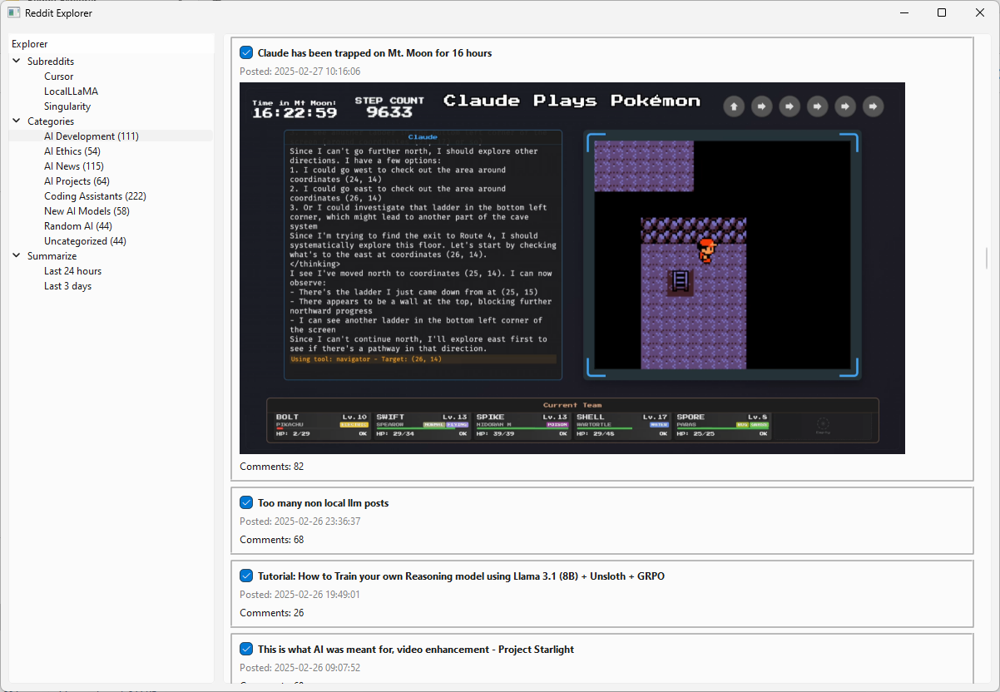
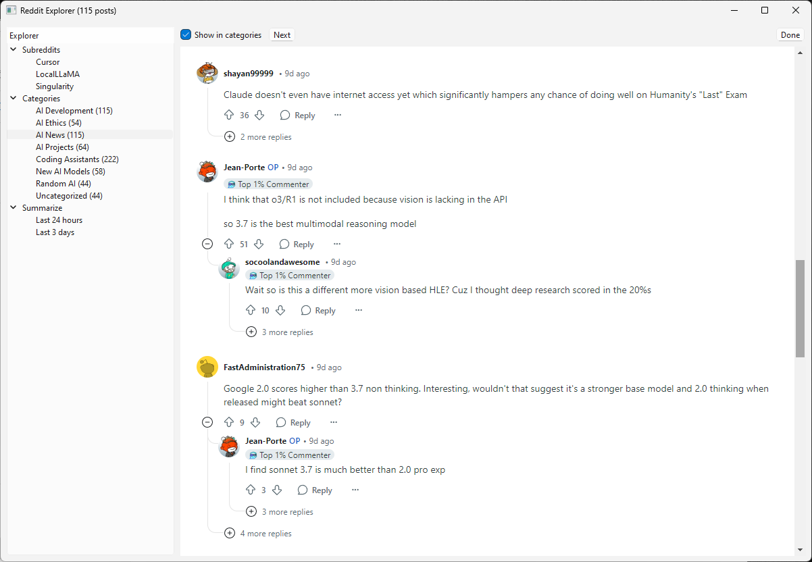
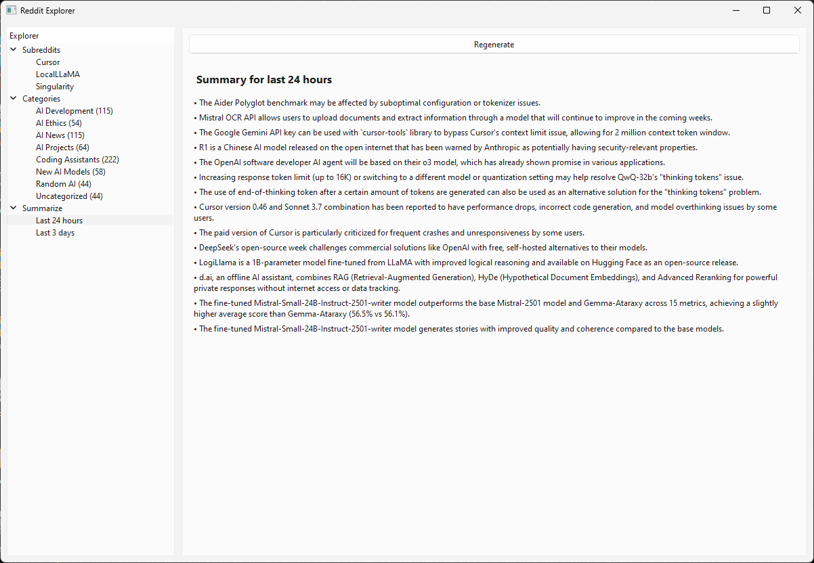

# Reddit Explorer

An AI-enhanced desktop application built with PySide6 that allows users to browse and save Reddit posts from their favorite subreddits.

## Features

- Browse posts from multiple subreddits
- Save interesting posts for later reading
- Organize saved posts into categories

- AI-powered features
  - Automatic post categorization
  - Post content summarization
  - Time-based summaries (last 24 hours, last 3 days)

## Screenshots

### Category View - Saved Posts


### Reddit Browser


### 24-Hour Summary


## Requirements

- Python 3.8+
- PySide6
- Requests
- OpenAI
- Python-dotenv

## Installation

1. Clone the repository:
```bash
git clone https://github.com/yourusername/reddit-explorer.git
cd reddit-explorer
```

2. (Optional but recommended) Create and activate a virtual environment:

On Windows:
```bash
python -m venv venv
venv\Scripts\activate
```

On macOS/Linux:
```bash
python -m venv venv
source venv/bin/activate
```

3. Install dependencies:
```bash
pip install -r requirements.txt
```

4. Rename .env.example to .env, and set the OpenAI settings

## Usage

Run the application using either of these methods:

1. Install the package in development mode and run:
```bash
python -m pip install -e .
reddit_explorer
```

2. Or run directly without installing:
```bash
python -m reddit_explorer.main
```

## License

MIT 